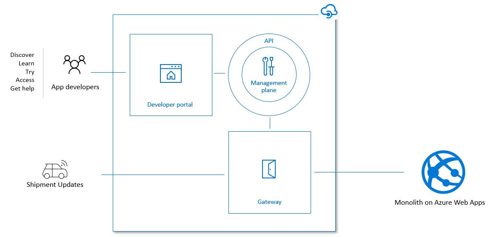

# Meet Contoso
Contoso provides industry-leading APIs for purchasing Microsoft Products.

Their customers can fully automate:
- Listing the product catalog
- Ordering products to be delivered at home
- Getting information about a shipment

To deliver all orders, they have partnered with multiple 3rd parties to deliver shipments.
These 3rd party service providers are in charge of providing updates about package deliveries.

This is handled by pushing status updates to a Contoso webhook endpoint.

## Where are they today?

As of today, Contoso is exposing their services via Azure API Management which gives them all the rich API ecosystem features they need ranging from service decoupling, developer portal, and user management.

Their monolith is hosted in an Azure Web App which is all written in .NET Core.

## Transition to microservices
Contoso wants to transition to microservices:
- Provide the capability to easily ship new features
- Allow services to run on specialized compute
- Increase service ownership

But, we need to ensure that
- Customer experience does not change
- Developers can experiment with new approaches with A/B testing
- Customers have one central gateway for all microservices

## How do we get there?
Use a phased-migration approach to reduce complexity and risk

Microservices are a journey:
1. Split the monolith into multiple smaller services
2. Ship them as individual containers

Use as much PaaS as you can, until you need more control:
- Azure App Services & Azure Integration Services are a good starting point.
- Easily port your same application to Azure Kubernetes Service, if you need more control.

Want to learn how?
- [Migrating to Azure Web App for Containers](./migrating-to-web-app-for-containers.md)
- [Migrating to Azure Kubernetes Service](./migrating-to-kubernetes.md)
