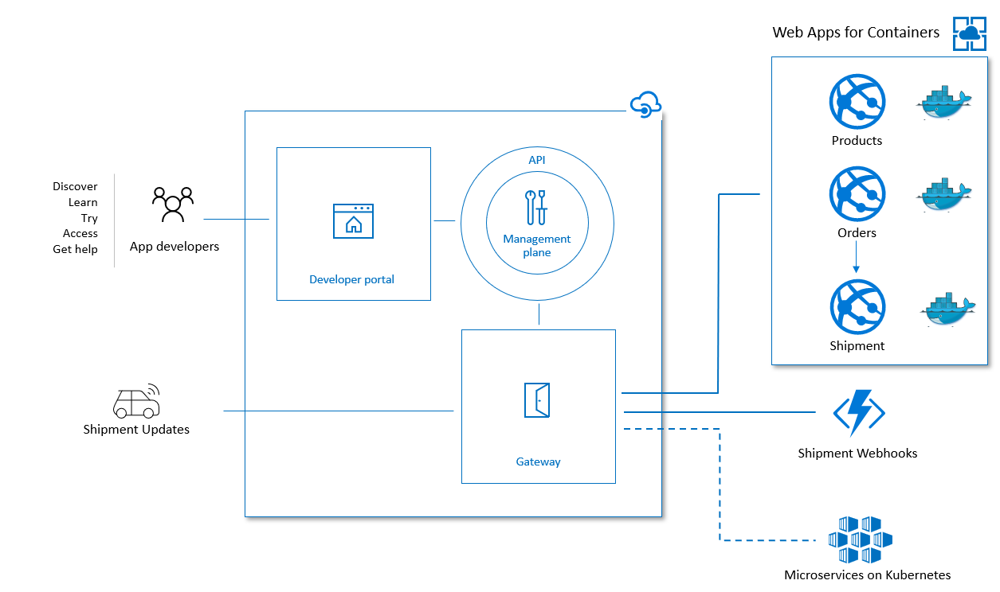

# Migrating to Azure Kubernetes Service

Azure Web Apps for Containers is a great way to offload all of the infrastructure to Microsoft Azure, but sometimes you need that extra control.

This is what is happening to Codito - Their business has been booming and as their customer demand is growing they need to scale to accomodate that and make sure they are always online.

While App Services can still give them that, they want to spin up their own Kubernetes container orchestrator as they will onboard more services and want everything in one managed cluster.

Codito has decided to change their internal design and migrate to Kubernetes. Instead of deploying their services as Web App they will create seperate Kubernetes deployments which run multiple copies of their services, this is known as "Pods" in Kubernetes.

Given Pods are locked down by default, the Shipment service will also provide an internal "Service" so that the Order service can still communicate with them.

In order to achieve this they will use the same A/B testing to guarantee that everything still works.

## Further Reading

Interested in how Codit can decouple internal services in the future? Read about it [here](./codito-tomorrow.md).