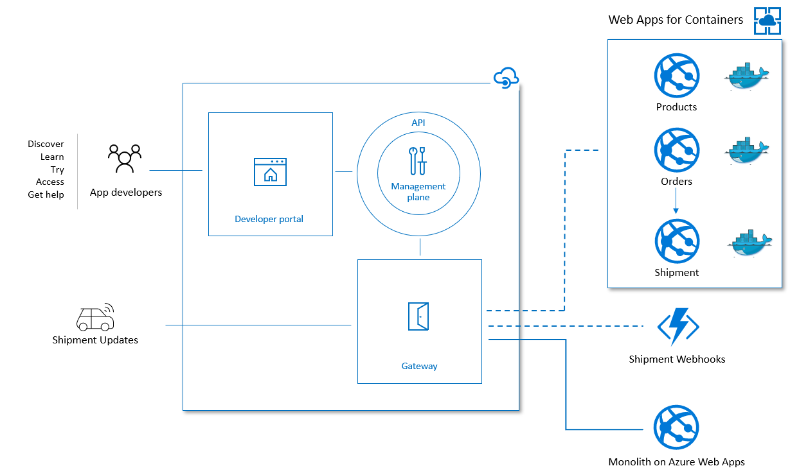

# Migrating to Azure Web App for Containers

Contoso loves Azure App Services, it allows them to run their APIs without having to worry about all the infrastructure beneath it!

With their migration into multiple microservices, they want to transition to containers as it makes it a lot easier to run and makes the application more portable.

However, they still want to benefit from the PaaS capabilities that Azure App Services provide so they have chosen to use Azure Web Apps for Containers!



## Migrating to Azure Web Apps for Containers
Azure Web Apps for Containers allows them to package their microservices as containers and deploy the containers on top of Azure App Services. During this migration Contoso change from packaging their app from a ZIP file to a Linux Docker container image.

As part of that transition, they also had to refactor their application as the Order service needs to be able to trigger shipments. Because of this, the Shipment service has added a new API endpoint which can be consumed internally given it's not opened up on Azure API Management given customers should not have access to it.

Contoso would like to experiment with serverless technologies as well, so they have decided to use Azure Functions for handling the Shipment webhook notifications coming from their 3rd party providers.

## Verifying the migration with A/B testing in Azure API Management

To ensure that their customers are not impacted Contoso wants to verify their experiment before deploying it to all environments.

They have chosen to use A/B testing where 50% of the traffic will be routed to the monolith and the other 50% will go to their containers running on Azure Web Apps for Containers.

Azure API Management is the perfect tool to manage this as all Contoso's traffic is routed through it, but unfortunately, traffic routing is not a supported capability out-of-the-box. Luckily they can use API Management policies to extend their APIs.

They managed to build a routing policy based on the [official sample](https://github.com/Azure/api-management-policy-snippets/blob/master/examples/Random%20load%20balancer.policy.xml) that they've found on GitHub.

```xml
<policies>
    <inbound>
        <base />
        <set-variable name="urlId" value="@(new Random(context.RequestId.GetHashCode()).Next(1, 3))" />
        <choose>
            <when condition="@(context.Variables.GetValueOrDefault<int>("urlId") == 1)">
                <!-- Use default host -->
            </when>
            <when condition="@(context.Variables.GetValueOrDefault<int>("urlId") == 2)">
                <set-backend-service base-url="https://microservices-with-apim-services-products.azurewebsites.net" />
            </when>
            <otherwise>
                <return-response>
                    <set-status code="500" reason="InternalServerError" />
                    <set-header name="Microsoft-Azure-Api-Management-Correlation-Id" exists-action="override">
                        <value>@{return Guid.NewGuid().ToString();}</value>
                    </set-header>
                    <set-body>A gateway-related error occurred while processing the request.</set-body>
                </return-response>
            </otherwise>
        </choose>
    </inbound>
    <backend>
        <base />
    </backend>
    <outbound>
        <base />
        <choose>
            <when condition="@(context.Variables.GetValueOrDefault<int>("urlId") == 1)">
                <set-header name="X-Runtime" exists-action="override">
                    <value>Legacy</value>
                </set-header>
            </when>
            <when condition="@(context.Variables.GetValueOrDefault<int>("urlId") == 2)">
                <set-header name="X-Runtime" exists-action="override">
                    <value>Experiment (App Services with Containers)</value>
                </set-header>
            </when>
            <otherwise />
        </choose>
    </outbound>
    <on-error>
        <base />
    </on-error>
</policies>
```

By randomizing they will distribute the traffic across upstream services and will add a custom header in order to know where the traffic was routed to. Given Contoso uses Azure Application Insights with Azure API Management, they can also troubleshoot the traffic routing via the Application Map.

### Caveats

Contoso aware that there are some caveats though:

- The policy is hardcoded and requires re-deployment if the URL or traffic weight changes
- The load balancing does not keep track of instance health, so if our experiment is down 50% of the requests will fail

## Further Reading

Interested in how they've migrated to Kubernetes? Read about it [here](./migrating-to-kubernetes.md).